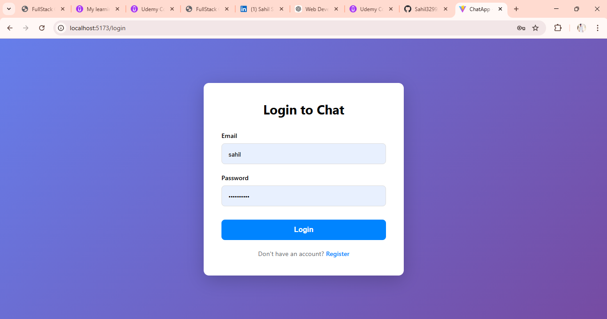
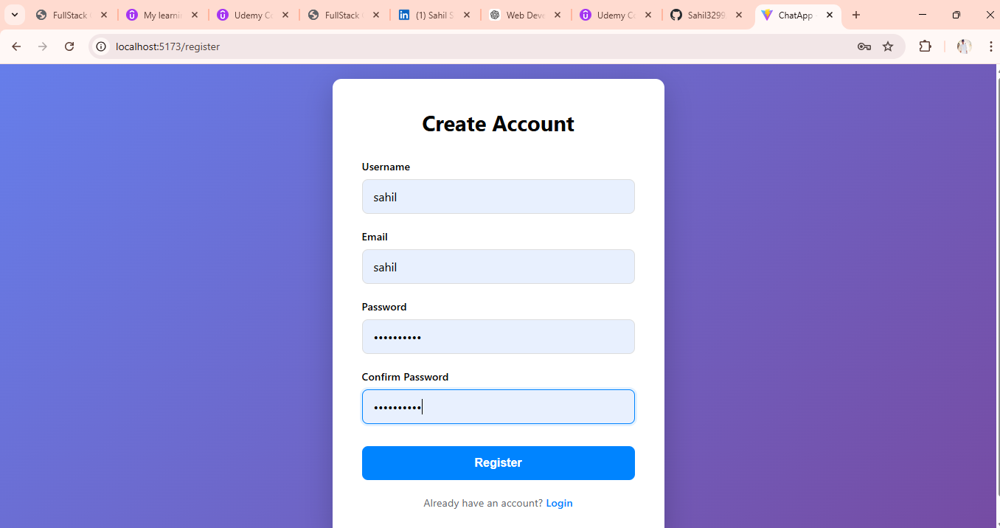

# 💬 Chat Application

<p align="center">
  <a href="https://github.com/sahil3299/chat-app/stargazers">
    
  </a>
  <a href="https://github.com/sahil3299/chat-app/network">
    
  </a>
  <a href="https://github.com/sahil3299/chat-app/issues">
    
  </a>
  
  
  
</p>

A full-stack real-time chat application built with the MERN stack (MongoDB, Express, React, Node.js) featuring Socket.IO for live messaging, user authentication, and presence indicators.

---

## 📸 Screenshots

<div align="center">

### 🔐 Login Page

*The secure authentication interface with email and password login*

### 📝 Registration Page

*User registration with username, email, and password*

### 💬 Chat Room

*Main chat interface with real-time messaging and user list*

### 👥 User Presence

*Online/offline status indicators for all users*

</div>

---

> 📌 **Note:** Replace the placeholder images above with actual screenshots of your application for a better showcase.

## 📋 Table of Contents

- [Screenshots](#-screenshots)
- [Overview](#overview)
- [Tech Stack](#tech-stack)
- [Features](#features)
- [Project Structure](#project-structure)
- [Prerequisites](#prerequisites)
- [Installation](#installation)
- [Environment Variables](#environment-variables)
- [Running the Application](#running-the-application)
- [API Endpoints](#api-endpoints)
- [Socket Events](#socket-events)
- [Database Models](#database-models)
- [Troubleshooting](#troubleshooting)
- [License](#license)

## 📖 Overview

This is a production-ready real-time chat application that allows users to:
- Register and authenticate securely
- Join chat rooms
- Send and receive messages in real-time
- See online users and their presence status
- View message history
- Get typing indicators

## 🛠 Tech Stack

### Backend
| Technology | Description |
|------------|-------------|
| **Node.js** | JavaScript runtime |
| **Express.js** | Web framework |
| **MongoDB** | NoSQL database |
| **Mongoose** | ODM for MongoDB |
| **Socket.IO** | Real-time communication |
| **JWT** | User authentication |
| **bcryptjs** | Password hashing |
| **winston** | Logging |

### Frontend
| Technology | Description |
|------------|-------------|
| **React** | UI library |
| **Vite** | Build tool |
| **React Router** | Client-side routing |
| **Socket.IO Client** | Real-time client |
| **Axios** | HTTP client |
| **date-fns** | Date formatting |

## ✨ Features

- ✅ **User Authentication** - Secure registration and login with JWT tokens
- ✅ **Real-time Messaging** - Instant message delivery via Socket.IO
- ✅ **Message Persistence** - All messages stored in MongoDB
- ✅ **Chat Rooms** - Multiple chat rooms with public access
- ✅ **Presence Indicators** - See who's online/offline
- ✅ **Typing Indicators** - Real-time typing notifications
- ✅ **Message History** - Load previous messages when joining a room
- ✅ **Read Receipts** - Mark messages as read
- ✅ **Responsive Design** - Works on desktop and mobile

## 📁 Project Structure

```
chat-app/
├── backend/
│   ├── src/
│   │   ├── config/
│   │   │   ├── database.js      # MongoDB connection
│   │   │   └── socket.js        # Socket.IO setup
│   │   ├── controllers/
│   │   │   ├── authController.js
│   │   │   ├── messageController.js
│   │   │   └── userController.js
│   │   ├── middleware/
│   │   │   ├── auth.js          # JWT authentication
│   │   │   └── errorHandler.js  # Error handling
│   │   ├── models/
│   │   │   ├── Message.js
│   │   │   ├── Room.js
│   │   │   └── User.js
│   │   ├── routes/
│   │   │   ├── authRoutes.js
│   │   │   ├── messageRoutes.js
│   │   │   └── userRoutes.js
│   │   ├── services/
│   │   │   ├── messageService.js
│   │   │   └── userService.js
│   │   ├── sockets/
│   │   │   ├── chatHandlers.js  # Chat socket events
│   │   │   └── presenceHandlers.js
│   │   ├── utils/
│   │   │   └── logger.js        # Winston logger
│   │   ├── scripts/
│   │   │   └── createDefaultRoom.js
│   │   └── server.js            # Entry point
│   ├── package.json
│   └── .env
│
└── frontend/
    ├── src/
    │   ├── components/
    │   │   ├── Auth/
    │   │   │   ├── Login.jsx
    │   │   │   └── Register.jsx
    │   │   ├── Chat/
    │   │   │   ├── ChatRoom.jsx
    │   │   │   ├── MessageList.jsx
    │   │   │   ├── MessageInput.jsx
    │   │   │   └── UserList.jsx
    │   │   └── Common/
    │   │       ├── Navbar.jsx
    │   │       └── PresenceIndicator.jsx
    │   ├── contexts/
    │   │   ├── AuthContext.jsx
    │   │   └── SocketContext.jsx
    │   ├── hooks/
    │   │   └── useChat.js
    │   ├── services/
    │   │   └── socket.js
    │   ├── App.jsx
    │   └── main.jsx
    ├── package.json
    ├── vite.config.js
    └── .env
```

## 🔧 Prerequisites

Before running the application, ensure you have:

- **Node.js** (v18 or higher) - [Download](https://nodejs.org/)
- **MongoDB** (v6.0 or higher) - [Download](https://www.mongodb.com/try/download/community)
  - Can use local MongoDB or MongoDB Atlas cloud

## 📦 Installation

### 1. Clone the Repository

```
bash
git clone <repository-url>
cd chat-app
```

### 2. Install Backend Dependencies

```
bash
cd backend
npm install
```

### 3. Install Frontend Dependencies

```
bash
cd frontend
npm install
```

## 🔐 Environment Variables

### Backend (`backend/.env`)

Create a `.env` file in the `backend` directory:

```
env
# Server Configuration
PORT=5000

# MongoDB Connection
# Local: mongodb://localhost:27017/chatapp
# Atlas: mongodb+srv://<username>:<password>@cluster.mongodb.net/chatapp
MONGODB_URI=mongodb://localhost:27017/chatapp

# JWT Configuration
JWT_SECRET=your_super_secret_jwt_key_here
JWT_EXPIRE=30d

# CORS Configuration
CORS_ORIGIN=http://localhost:5173
```

### Frontend (`frontend/.env`)

Create a `.env` file in the `frontend` directory:

```
env
# API URL
VITE_API_URL=http://localhost:5000
```

## 🚀 Running the Application

### Option 1: Run Both Separately

**Terminal 1 - Backend:**
```
bash
cd backend
npm run dev
```

**Terminal 2 - Frontend:**
```
bash
cd frontend
npm run dev
```

### Option 2: Run in Background

```
bash
# Start backend (runs on port 5000)
cd backend && npm start &

# Start frontend (runs on port 5173)
cd frontend && npm run dev &
```

### Access the Application

- **Frontend:** http://localhost:5173
- **Backend API:** http://localhost:5000
- **Health Check:** http://localhost:5000/health

## 📡 API Endpoints

### Authentication Routes (`/api/auth`)

| Method | Endpoint | Description | Auth Required |
|--------|----------|-------------|---------------|
| POST | `/api/auth/register` | Register a new user | ❌ |
| POST | `/api/auth/login` | Login user | ❌ |
| GET | `/api/auth/me` | Get current user | ✅ |

### Message Routes (`/api/messages`)

| Method | Endpoint | Description | Auth Required |
|--------|----------|-------------|---------------|
| GET | `/api/messages/:roomId` | Get room messages | ✅ |
| POST | `/api/messages` | Send a message | ✅ |

### User Routes (`/api/users`)

| Method | Endpoint | Description | Auth Required |
|--------|----------|-------------|---------------|
| GET | `/api/users` | Get all users | ✅ |
| GET | `/api/users/:id` | Get user by ID | ✅ |

### System Routes

| Method | Endpoint | Description |
|--------|----------|-------------|
| GET | `/health` | Health check |
| POST | `/create-default-room` | Create default chat room |

## 📱 Socket Events

### Client → Server

| Event | Payload | Description |
|-------|---------|-------------|
| `join:room` | `{ roomId }` | Join a chat room |
| `leave:room` | `{ roomId }` | Leave a chat room |
| `message:send` | `{ roomId, content, type }` | Send a message |
| `typing:start` | `{ roomId }` | User started typing |
| `typing:stop` | `{ roomId }` | User stopped typing |
| `messages:read` | `{ roomId, messageIds }` | Mark messages as read |

### Server → Client

| Event | Payload | Description |
|-------|---------|-------------|
| `room:joined` | `{ roomId, messages }` | Successfully joined room |
| `message:received` | `{ message, timestamp }` | New message received |
| `user:joined` | `{ userId, username, timestamp }` | User joined room |
| `user:left` | `{ userId, username, timestamp }` | User left room |
| `user:typing` | `{ userId, username }` | User is typing |
| `user:stop-typing` | `{ userId, username }` | User stopped typing |
| `messages:read` | `{ userId, messageIds }` | Messages read |
| `error` | `{ message }` | Error occurred |

## 🗄 Database Models

### User Model
```
javascript
{
  username: String (required, unique),
  email: String (required, unique),
  password: String (required, hashed),
  avatar: String (optional),
  isOnline: Boolean (default: false),
  lastSeen: Date
}
```

### Room Model
```
javascript
{
  name: String (required),
  type: String (enum: ['public', 'private']),
  participants: [ObjectId -> User],
  admin: ObjectId -> User,
  lastMessage: ObjectId -> Message,
  isActive: Boolean (default: true),
  createdAt: Date,
  updatedAt: Date
}
```

### Message Model
```
javascript
{
  room: ObjectId -> Room (required),
  sender: ObjectId -> User (required),
  content: String (required),
  type: String (enum: ['text', 'image', 'file']),
  readBy: [{
    user: ObjectId -> User,
    readAt: Date
  }],
  createdAt: Date,
  updatedAt: Date
}
```

## 🔍 Troubleshooting

### Common Issues

#### 1. MongoDB Connection Failed
```
bash
# Check if MongoDB is running
mongod

# Or use MongoDB Atlas and verify connection string
```

#### 2. Port Already in Use
```
bash
# Find process using port 5000
netstat -ano | findstr :5000

# Kill the process
taskkill /PID <PID> /F
```

#### 3. CORS Errors
- Ensure `CORS_ORIGIN` in backend `.env` matches your frontend URL
- Default: `http://localhost:5173`

#### 4. JWT Token Issues
- Clear browser localStorage
- Check `JWT_SECRET` matches in backend

#### 5. Socket Connection Failed
- Ensure backend is running on port 5000
- Check firewall settings
- Verify WebSocket is not blocked

### Logs Location
- Backend logs: `backend/logs/`


---

Built by sahil shinde using MERN Stack + Socket.IO
